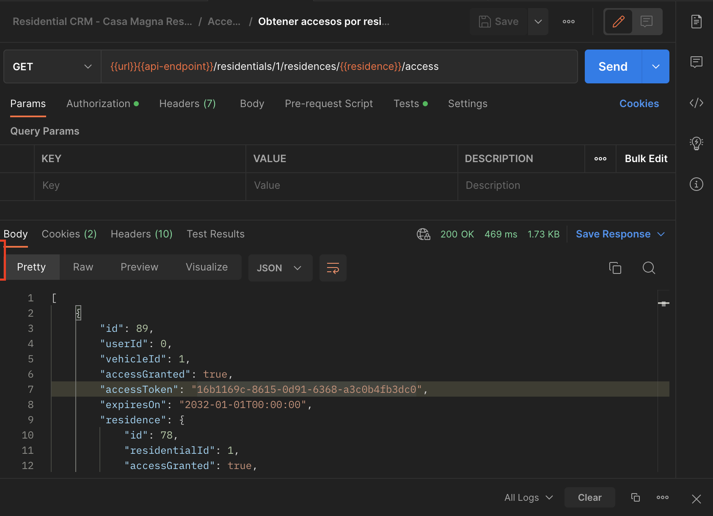

# R-CRM API
# Uso de la API para administración

**Residentials-CRM** es un sistema de gestion para residenciales, destinado a administrar múltiples aspectos del ecosistema que incluye: accesos, residentes, administraciones y consejos directivos.

&nbsp;
 # Gestión de Accesos

R-CRM cuenta, entre sus características acutales, con la funcionalidad necesaria para la gestion de los accesos generados. Dicha gestion se realiza a travez de una API, que brinda operaciones funcionales de alta, baja, habilitación/deshabilitación de los **TOKEN**. 

El contron de accessos se realiza mediante un **TOKEN** de acceso dispuesto a travez de un QR previamente generado.

## Habilitación/deshabilitación de accesos

La habilitación/deshabilitación de accesos mediante la API R-CRM: se realiza de dos formas diferentes: 

1. De forma individual: mediente la habilitación/deshabilitación del **TOKEN** de acceso (QR) de manera especifica.

2. Mediante la habilitación/deshabilitación de los **TOKEN** de acceso (QRs) ligados a una residencia, por lo que todos los **TOKEN** de acceso ligados a una resdiencia en concreto, quedan deshabilitados cuando se deshabilita el acceso de una residencia.

### Habilitación/Deshabilitación de accesos.

1. Usando la applicación web Postman, dirigete al workspace de la API: [Residential-CSM - Claustros de Santa María](https://web.postman.co/workspace/My-Workspace~a4514fd3-4223-46c9-820a-dd433667e86f/collection/25031326-e0eb8ee2-eb82-4409-a4ea-94063327f427)

### Habilitación/Deshabilitación de accesos por residencia.

1. Usando la applicación web Postman, dirigete al workspace de la API: [Residential-CSM - Claustros de Santa María](https://web.postman.co/workspace/My-Workspace~a4514fd3-4223-46c9-820a-dd433667e86f/collection/25031326-e0eb8ee2-eb82-4409-a4ea-94063327f427) dónde visualizarás la siguiente pantalla:

2. Localiza la etiqueta: **"No Environmet"** en la esquina superior derecha de la pantalla para que puedas inicializar los valores requeridos para CMR:

3. Haz click el arrow ▿ para que puedas selccionar el ambiente requerido:

 

4. Una vez seleccionado el ambiente requerido, dirígete al directorio **Residencias** y haz doble click en el item: _[PATCH Actualizar acceso de residencia](https://web.postman.co/workspace/My-Workspace~a4514fd3-4223-46c9-820a-dd433667e86f/request/25031326-fdfea530-1f60-4044-99b2-4d2128b78c76)_ en el panel izquierdo de la pantalla.

5. Para habilitar/deshabilitar los **TOKEN** de accesos asociados a una residencia en particular, primero deberás introducir el número de la residencia dentro de el panel de variables, para ello deberas hacer click en el icono de ambientes  localizado en parte superior deracha de la pantalla, al hacer click visualizarás la siguiente pantalla:

6. Edita el valor de la residencia haciendo click en el icono de edicion  agregando el valor para la residencia a actualizar el estado 

7. Haz click en el boton **"Send"**  para enviar la peticion de cambio, ésta característca funciona como un swich de _on/off_, cambiando de un estado a otro segun corresponda, por lo que si el estado actual de la residencia es habilitado, pasará a deshabilitado y viceversa

    En el panel de respuesta observaras el resultado de la petición junto con información de control  teniendo la información necesaria para identificar que la petición se ejecuto de forma correcta, el valor 200 OK significa que la petición se ejecuto correctamente en el sistema y el tiemo en milisegundos que tomo su ejecución y respuesta.

    El panel de respuesta muestra información de la petición generada, siendo el valor del identificador **"id"** el número que indica la residencia y el indicador **"accessGranted"** el estado actual del los **TOKEN** de acceso ligados a dicha residencia, siendo false el equivalene de _inhabilitado_ por lo que en el siguiente ejemplo se paso de un estado habilitado a inhabilitado:

    

    Si se hace click nuevamente en el boton **"Send"**  la peticion generará un cambio de estado de deshabilitado a habilitado:

    

> Nota, por seguridad, cada vez que se ejecuta la accion **"Send"**  se borran todas las variables introducidas para evitar realizar un cambio no deseado con información previamente capturada, por lo que antes de cada acción se debeb introducir las variables deseadas.

&nbsp;
&nbsp;

## Alta (asignación), baja (eliminación) y/o modificaicón de un **TOKEN** de acceso.

### Asignación de accesos

La asignación de un **TOKEN** de acceso es el proceso por el cual se podrán registrar nuevos accesos a una residencia en particular o sustituir uno ya existente.

El proceso para asignación de un **TOKEN** de acceso (QR) consta de dos pasos:

    1. La eliminación o baja de un **TOKEN** de acceso existente y ya asignado.
    2. La asignación o alta de un **TOKEN** de acceso nuevo.

&nbsp;

### Eliminación o baja de un **TOKEN** de acceso

La eliminación de un **TOKEN** de acceso será el proceso por el cual se anula un **TOKEN** de acceso (QR) asignado, lo que significa que se borrará permanente de la base de datos y no existe forma de recuperarlo.

La necesidad de llevar a cabo éste proceo se puede dar por diversas razones, por mencionar algunas se encuentran: 

- Eliminar un **TOKEN** de acceso (QR) por robo o extravio, lo cual implica dar de baja permanentemente el **TOKEN** de acceso en cuestion y sustituirlo por uno nuevo.
- Eliminar un **TOKEN** de acceso (QR) para ser remplazado por uno nuevo debido al mal estado o deteriro del actual.

Para elminar un **TOKEN** de acceso (QR) es ncesario contar con el identificador único llamado: **TOKEN**, el cual es un valor alfanumérico de 32 (_**0b606529fc7247f985af8296978ff734**_) ó 36 (_**0b606529-fc72-47f9-85af-8296978ff734**_) caracteres dependiendo de si incluye cuatro guiones medios o no.

Para localizar éste **TOKEN** de acceso único se pude hacer de dos formas:

- Obtener el valor del **TOKEN** de acceso (QR) del archivo de excel donde se tiene el registro y control de los QRs generados; asignados y no asignados.
- Relizar una consulta usando la applicación web Postman para obtener los **TOKEN** de acceso (QR) asignados a una residencia.

### Obtener el valor del **TOKEN** de acceso (QR) del archivo de excel donde se tiene el registro y control de los QRs generados; asignados y no asignados.

1.  Obtener el **TOKEN** de acceso (QR) acutal, para ello deberás buscar dentro del archivo de excel el valor del token a 32 dígitos que sera eliminado para sustituirlo por el nuevo, asgurate de seleccionar el **TOKEN** de acceso (QR) actualmente asignado a una residencia y vehiculo el cual será sustituido:

2. Usando la applicación web Postman, dirigete al workspace de la API: [Residential-CSM - Claustros de Santa María](https://web.postman.co/workspace/My-Workspace~a4514fd3-4223-46c9-820a-dd433667e86f/collection/25031326-e0eb8ee2-eb82-4409-a4ea-94063327f427) dónde visualizarás la siguiente pantalla:

3. Localiza la etiqueta: **"No Environmet"** en la esquina superior derecha de la pantalla para que puedas inicializar los valores requeridos para CMR:

3. Haz click el arrow ▿ para que puedas selccionar el ambiente requerido:

 

4. Una vez seleccionado el ambiente requerido, dirígete al directorio **Accesos** y haz doble click en el item: _[**DEL** Borrar acceso](https://web.postman.co/workspace/My-Workspace~a4514fd3-4223-46c9-820a-dd433667e86f/request/25031326-6c081062-99f6-49c3-a718-74f0000451ea)_ en el panel izquierdo de la pantalla.

5. Para eliminar el **TOKEN** de acceso (QR), primero deberás introducir el valor del **TOKEN** dentro de el panel de variables, para ello deberas hacer click en el icono de ambientes  localizado en parte superior deracha de la pantalla, al hacer click visualizarás la siguiente pantalla:

6. Edita el valor **"access"** haciendo click en el icono de edicion  agregando el valor de 32 caracteres para **TOKEN** de acceso (QR) que deberá ser eliminado. 

7. Haz click en el boton **"Send"**  para enviar la peticion que eliminara el **TOKEN** de acceso (QR).

    En el panel de respuesta observaras el resultado de la petición junto con información de control  teniendo la información necesaria para identificar que la petición se ejecuto de forma correcta, el valor 200 OK significa que la petición se ejecuto correctamente en el sistema y el tiemo en milisegundos que tomo su ejecución y respuesta.

    El panel de respuesta muestra información del **TOKEN** de acceso (QR) eliminado que será importante para el siguiente paso. 
    - El indicador **"vehicleId"** es el vehiculo de la residencia al cual estba asignado ese **TOKEN** de acceso y deberas tomar nota del mismo, aunque tambien esta referenciado el archivo de excel; **_cada residencial y residencia puede tener asignado uno o más vehiculos por residencia pro lo que dependiendo de las configuraciones e infraestrucutra física del residencial la cantidad de vehiculos más comunes son un o dos vehiculos por residencia_**
       
    El conjunto de información despues del indicador **"residence"** muestra información relacionada a la residencia consultada, siendo el valor del identificador **"id"** el número de la residencia,  **"residentialId"** el indicador del residencial y **"accessGranted"** el indicador del estado actual para los accesos de dicha residencia, siendo false el equivalene de _inhabilitado_  y true el equivalente a _habilitado_.

    

    >Nota, para realizar la asignación del nuevo **TOKEN** de acceso (QR) dirigete e la sección correspondiente: Asignacion **TOKEN** de acceso
    

> Nota, por seguridad, cada vez que se ejecuta la accion **"Send"**  se borran todas las variables introducidas para evitar realizar un cambio no deseado con información previamente capturada, por lo que antes de cada acción se debeb introducir las variables deseadas.

### Relizar una consulta usando la applicación web Postman para obtener los **TOKEN** de acceso (QR) asignados a una residencia.

1. Usando la applicación web Postman, dirigete al workspace de la API: [Residential-CSM - Claustros de Santa María](https://web.postman.co/workspace/My-Workspace~a4514fd3-4223-46c9-820a-dd433667e86f/collection/25031326-e0eb8ee2-eb82-4409-a4ea-94063327f427) dónde visualizarás la siguiente pantalla:

2. Localiza la etiqueta: **"No Environmet"** en la esquina superior derecha de la pantalla para que puedas inicializar los valores requeridos para CMR:

3. Haz click el arrow ▿ para que puedas selccionar el ambiente requerido:

 

4. Una vez seleccionado el ambiente requerido, dirígete al directorio **Accesos** y haz doble click en el item: _[**GET** Obtener accesos por residencia](https://web.postman.co/workspace/My-Workspace~a4514fd3-4223-46c9-820a-dd433667e86f/request/25031326-9c65f195-cf30-462a-8715-761a8e2907c7)_ en el panel izquierdo de la pantalla.

5. Para consultar los **TOKEN** de accesos asociados a una residencia en particular, primero deberás introducir el número de la residencia dentro de el panel de variables, para ello deberas hacer click en el icono de ambientes  localizado en parte superior deracha de la pantalla, al hacer click visualizarás la siguiente pantalla:

6. Edita el valor de la residencia haciendo click en el icono de edicion  agregando el valor para la residencia de la cual desas consultar sus accesos 

7. Haz click en el boton **"Send"**  para enviar la peticion de consulta.

    En el panel de respuesta observaras el resultado de la petición junto con información de control  teniendo la información necesaria para identificar que la petición se ejecuto de forma correcta, el valor 200 OK significa que la petición se ejecuto correctamente en el sistema y el tiemo en milisegundos que tomo su ejecución y respuesta.

    El panel de respuesta muestra información de la petición de consulta generada información que será importante para el siguiente paso. 
    - El identificador **"id"** un idientificador numérico para dicho **TOKEN** de acceso.
    - El indicador **"vehicleId"** es el vehiculo de la residencia al cual está asignado ese **TOKEN** de acceso y deberas tomar nota del mismo; **_cada residencial y residencia puede tener asignado uno o más vehiculos por residencia pro lo que dependiendo de las configuraciones e infraestrucutra física del residencial la cantidad de vehiculos más comunes son un o dos vehiculos por residencia_**
    - El indicador **"accessGranted"** muestra el estado actual del **TOKEN** de acceso en cuestion.
    - El indicador **"accessToken"** muestra el **TOKEN** de acceso de 36 caracteres requerido para realizar la baja, por lo que deberas copiarlo.

    > Nota, el **TOKEN** de acceso de 36 caracteres requerido, será aquel que coincida con el proporcionado por el usario en cuestion, es decir: si un usuario requiere dar de baja un **TOKEN** de acceso (QR) éste deberá proporcionar el idientificador del mismo que pude ser algo como: **ACCESO XXX000-1**, **ACCESO XXX000-2** siendo el identificador 1 o 2 el vehiculo al cual esta asignado dicho **TOKEN** de acceso (QR) o **ACCESO 0b606529** siendo los 8 caracteres la parte inicial de la cadena de 36 caracteres.
     
    El conjunto de información despues del indicador **"residence"** muestra información relacionada a la residencia consultada, siendo el valor del identificador **"id"** el número de la residencia,  **"residentialId"** el indicador del residencial y **"accessGranted"** el indicador del estado actual para los accesos de dicha residencia, siendo false el equivalene de _inhabilitado_  y true el equivalente a _habilitado_.

    

8. Una vez has obtenido el valor de 32 caracteres del **TOKEN** de acceso (QR), dirígete al directorio **Accesos** y haz doble click en el item: _[**DEL** Borrar acceso](https://web.postman.co/workspace/My-Workspace~a4514fd3-4223-46c9-820a-dd433667e86f/request/25031326-6c081062-99f6-49c3-a718-74f0000451ea)_ en el panel izquierdo de la pantalla.

9. Para eliminar el **TOKEN** de acceso (QR), primero deberás introducir el valor del **TOKEN** dentro de el panel de variables, para ello deberas hacer click en el icono de ambientes  localizado en parte superior deracha de la pantalla, al hacer click visualizarás la siguiente pantalla:

10. Edita el valor **"access"** haciendo click en el icono de edicion  agregando el valor de 32 caracteres para **TOKEN** de acceso (QR) que deberá ser eliminado. 

11. Haz click en el boton **"Send"**  para enviar la peticion que eliminara el **TOKEN** de acceso (QR).

    En el panel de respuesta observaras el resultado de la petición junto con información de control  teniendo la información necesaria para identificar que la petición se ejecuto de forma correcta, el valor 200 OK significa que la petición se ejecuto correctamente en el sistema y el tiemo en milisegundos que tomo su ejecución y respuesta.

    El panel de respuesta muestra información del **TOKEN** de acceso (QR) eliminado que será importante para el siguiente paso. 
    - El indicador **"vehicleId"** es el vehiculo de la residencia al cual estba asignado ese **TOKEN** de acceso y deberas tomar nota del mismo, aunque tambien esta referenciado el archivo de excel; **_cada residencial y residencia puede tener asignado uno o más vehiculos por residencia pro lo que dependiendo de las configuraciones e infraestrucutra física del residencial la cantidad de vehiculos más comunes son un o dos vehiculos por residencia_**
       
    El conjunto de información despues del indicador **"residence"** muestra información relacionada a la residencia consultada, siendo el valor del identificador **"id"** el número de la residencia,  **"residentialId"** el indicador del residencial y **"accessGranted"** el indicador del estado actual para los accesos de dicha residencia, siendo false el equivalene de _inhabilitado_  y true el equivalente a _habilitado_.

    

    >Nota, para realizar la asignación del nuevo **TOKEN** de acceso (QR) dirigete e la sección correspondiente: Asignacion **TOKEN** de acceso
    

> Nota, por seguridad, cada vez que se ejecuta la accion **"Send"**  se borran todas las variables introducidas para evitar realizar un cambio no deseado con información previamente capturada, por lo que antes de cada acción se debeb introducir las variables deseadas.

### Asignación de un **TOKEN** de acceso (QR).

1. Selecciona un QR físico de los que no se han asignado aún y localiza el su identificador en la tabla del archivo del excel que cuenta con los **TOKEN** de accesos (QR) no asignados:

2 Copia el valor de la columna **Access Token** y recuerda llenar las columnas de a que casa y vehiuclo se esta asignando este nuevo sticker para futuras referencias:

1. Usando la applicación web Postman, dirigete al workspace de la API: [Residential-CSM - Claustros de Santa María](https://web.postman.co/workspace/My-Workspace~a4514fd3-4223-46c9-820a-dd433667e86f/collection/25031326-e0eb8ee2-eb82-4409-a4ea-94063327f427) dónde visualizarás la siguiente pantalla:

2. Localiza la etiqueta: **"No Environmet"** en la esquina superior derecha de la pantalla para que puedas inicializar los valores requeridos para CMR:

3. Haz click el arrow ▿ para que puedas selccionar el ambiente requerido:

 

4. Una vez seleccionado el ambiente requerido, dirígete al directorio **Accesos** y haz doble click en el item: _[**PATCH** Asignar un nuevo acceso](https://web.postman.co/workspace/My-Workspace~a4514fd3-4223-46c9-820a-dd433667e86f/request/25031326-d2243da0-fd2a-4066-b291-847008edcc30)_ en el panel izquierdo de la pantalla.

5. Para asignar un **TOKEN** de accesos (QR) nuevo y asociarlo a una residencia y vehiculo en particular, primero deberás introducir los sigientes valores dentro de el panel de variables:
- **"access"** el valor del acceso a 32 o 36 dígitos, no hay diferencia si se usan logs guiones o no, el sistme valida el input
- **"residence"**, que es el número de la residencia
- **"vehicle"** el id del vehiculo
Para ello deberas hacer click en el icono de ambientes  localizado en parte superior deracha de la pantalla, al hacer click visualizarás la siguiente pantalla:

6. Edita el valor de los campos mencionados haciendo click en el icono de edicion  agregando el valor para cada uno de ellos

7. Haz click en el boton **"Send"**  para enviar la peticion de consulta.

    En el panel de respuesta observaras el resultado de la petición junto con información de control  teniendo la información necesaria para identificar que la petición se ejecuto de forma correcta, el valor 200 OK significa que la petición se ejecuto correctamente en el sistema y el tiemo en milisegundos que tomo su ejecución y respuesta.

    El panel de respuesta muestra información de la petición de consulta generada información que será importante para el siguiente paso. 
    - El identificador **"id"** un idientificador numérico para dicho **TOKEN** de acceso.
    - El indicador **"vehicleId"** es el vehiculo de la residencia al cual está asignado ese **TOKEN** de acceso y deberas tomar nota del mismo; **_cada residencial y residencia puede tener asignado uno o más vehiculos por residencia pro lo que dependiendo de las configuraciones e infraestrucutra física del residencial la cantidad de vehiculos más comunes son un o dos vehiculos por residencia_**
    - El indicador **"accessGranted"** muestra el estado actual del **TOKEN** de acceso en cuestion.
    - El indicador **"accessToken"** muestra el **TOKEN** de acceso de 36 caracteres requerido para realizar la baja, por lo que deberas copiarlo.

    > Nota, el **TOKEN** de acceso de 36 caracteres requerido, será aquel que coincida con el proporcionado por el usario en cuestion, es decir: si un usuario requiere dar de baja un **TOKEN** de acceso (QR) éste deberá proporcionar el idientificador del mismo que pude ser algo como: **ACCESO XXX000-1**, **ACCESO XXX000-2** siendo el identificador 1 o 2 el vehiculo al cual esta asignado dicho **TOKEN** de acceso (QR) o **ACCESO 0b606529** siendo los 8 caracteres la parte inicial de la cadena de 36 caracteres.
     
    

8. Para validar el cambio puedes revisar los accesos asignados a la residencia en cuestion.

> Nota, por seguridad, cada vez que se ejecuta la accion **"Send"**  se borran todas las variables introducidas para evitar realizar un cambio no deseado con información previamente capturada, por lo que antes de cada acción se debeb introducir las variables deseadas.

